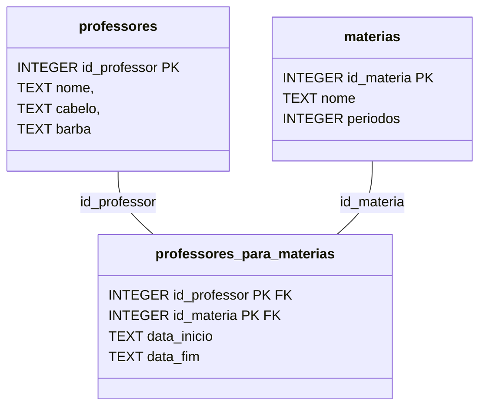

```mermaid
classDiagram
    class professores {
        INTEGER id_professor PK
        TEXT nome,
        TEXT cabelo,
        TEXT barba
    }
    
    class materias {
        INTEGER id_materia PK
        TEXT nome
        INTEGER periodos
    }
    
    class professores_para_materias {
        INTEGER id_professor PK FK
        INTEGER id_materia PK FK
        TEXT data_inicio
        TEXT data_fim 
    }
    
    professores -- professores_para_materias : id_professor
    materias -- professores_para_materias : id_materia
```