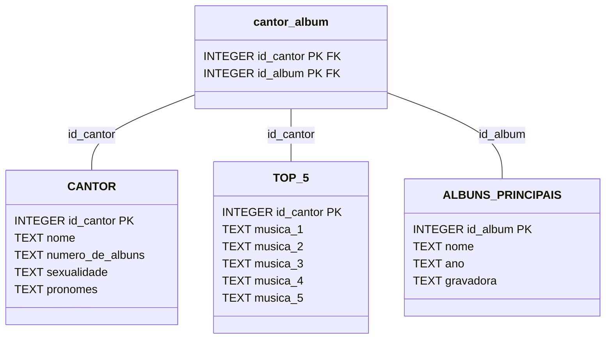

```mermaid
classDiagram
    class CANTOR{
        INTEGER id_cantor PK 
        TEXT nome
        TEXT numero_de_albuns
        TEXT sexualidade
        TEXT pronomes 
    }
    class ALBUNS_PRINCIPAIS{
        INTEGER id_album PK 
        TEXT nome
        TEXT ano
        TEXT gravadora
    }
     class TOP_5{
        INTEGER id_cantor PK 
        TEXT musica_1
        TEXT musica_2
        TEXT musica_3
        TEXT musica_4
        TEXT musica_5
    }
 cantor_album -- CANTOR:id_cantor 
 cantor_album -- TOP_5:id_cantor
 cantor_album -- ALBUNS_PRINCIPAIS:id_album
 cantor_album: INTEGER id_cantor PK FK
 cantor_album: INTEGER id_album PK FK
```